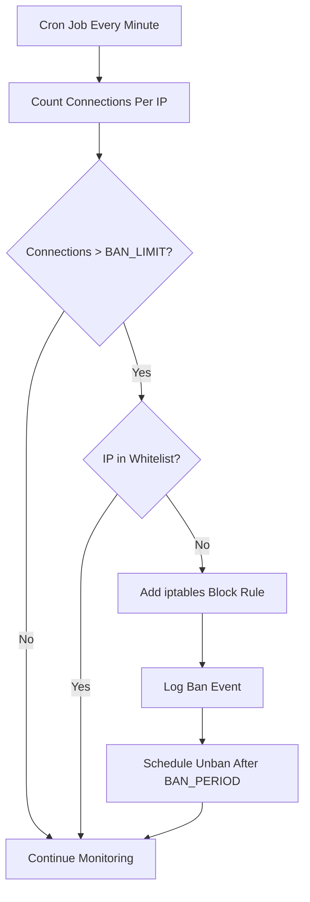

<Warning>
  **Status**: Deprecated - This project has reached End-of-Life (EOL) and End-of-Support (EOS). No longer supported or updated.
</Warning>

## Overview

DDoS Deflate is a lightweight script designed to mitigate distributed denial of service (DDoS) attacks on Linux servers by monitoring the number of active connections per IP address. IP addresses that exceed a predefined threshold will be blocked, reducing the load caused by malicious traffic.

## Original Project

| Author | Contributors | Version | Last Update |
|--------|--------------|---------|-------------|
| [Zaf](mailto:zaf@vsnl.com) | [Colin Mollenhour](mailto:colin@mollenhour.com) | 0.6 | 2012 |

## System Requirements

<CardGroup cols={2}>
  <Card title="Operating System" icon="ubuntu">
    Ubuntu 20.04/22.04/24.04 x64
  </Card>
  <Card title="Dependencies" icon="boxes-stacked">
    bash, iptables, dnsutils, net-tools
  </Card>
</CardGroup>

## Installation

### Download Project

First, download the project using the gitfolder utility:

```bash
sudo apt install -y python-is-python3
wget -qO gitfolder.py https://raw.githubusercontent.com/maravento/vault/master/scripts/python/gitfolder.py
chmod +x gitfolder.py
python gitfolder.py https://github.com/maravento/vault/ddos
```

### Install DDoS Deflate

Run the installation script:

```bash
wget -qO ddosinstall.sh https://raw.githubusercontent.com/maravento/vault/master/ddos/ddosinstall.sh
chmod +x ddosinstall.sh
sudo ./ddosinstall.sh
```

<Info>
  The script automatically configures a cron job to run every minute and monitor active connections.
</Info>

## Configuration

### Default Settings

The script runs every minute with these default settings:

- **Ban Limit**: 150 simultaneous active connections
- **Ban Period**: 600 seconds (10 minutes)
- **Excluded IPs**: System IPs running DDoS-Deflate

### Customize Configuration

Edit the configuration file to adjust thresholds:

```bash
sudo nano /usr/local/ddos/ddos.conf
```

#### Key Configuration Options

<CodeGroup>

```bash Connection Limit
# Maximum number of connections before banning
BAN_LIMIT=150
```

```bash Ban Duration
# How long to ban the IP (in seconds)
BAN_PERIOD=600
```

```bash Email Alerts
# Email address for ban notifications
EMAIL_TO="admin@example.com"
```

</CodeGroup>

### Configuration Files

| File | Purpose | Location |
|------|---------|----------|
| **Configuration** | Main settings and thresholds | `/usr/local/ddos/ddos.conf` |
| **Whitelist** | IP addresses to never ban | `/usr/local/ddos/ignore` |
| **Ban Log** | Record of banned IPs | `/usr/local/ddos/ddos.log` |

## Usage

### Add IPs to Whitelist

Prevent specific IPs from being banned:

```bash
sudo nano /usr/local/ddos/ignore

# Add one IP per line
192.168.1.1
10.0.0.50
203.0.113.25
```

<Tip>
  Always whitelist your own management IPs and trusted servers to avoid locking yourself out.
</Tip>

### Monitor Banned IPs

Check which IPs have been banned:

```bash
cat /usr/local/ddos/ddos.log
```

**Example output:**

```
Banned the following ip addresses on mar 22 abr 2025 11:21:01 -05
BANNED: 192.168.1.126 with 151 connections ()

Banned the following ip addresses on mar 22 abr 2025 11:59:02 -05
BANNED: 192.168.1.143 with 356 connections ()
BANNED: 104.91.161.199 with 166 connections (a104-91-161-199.deploy.static.akamaitechnologies.com.)
```

### View System Logs

Check cron execution logs:

```bash
grep ddos.sh /var/log/syslog
```

**Example output:**

```
Apr 22 14:11:01 user CRON[669435]: (root) CMD (/usr/local/ddos/ddos.sh &> /dev/null)
Apr 22 14:12:01 user CRON[669486]: (root) CMD (/usr/local/ddos/ddos.sh &> /dev/null)
```

## How It Works



### Detection Process

1. **Connection Monitoring**: Script runs every minute via cron
2. **Count Active Connections**: Uses `netstat` to count connections per IP
3. **Threshold Check**: Compares connection count against `BAN_LIMIT`
4. **Whitelist Verification**: Checks if IP is in ignore list
5. **Apply Ban**: Adds iptables rule to block traffic from offending IP
6. **Logging**: Records ban event with timestamp and hostname resolution
7. **Automatic Unban**: Removes block after `BAN_PERIOD` expires

## Uninstallation

To completely remove DDoS Deflate:

```bash
sudo rm -rf /usr/local/ddos
sudo crontab -l | grep -v '/usr/local/ddos/ddos.sh' | sudo crontab -
```

<Warning>
  Uninstallation will remove all configuration files and the cron job. Existing iptables rules may need manual cleanup.
</Warning>

## Limitations

<AccordionGroup>
  <Accordion title="End of Life Status">
    This project is no longer maintained. The last update was in 2012. Consider using modern alternatives like fail2ban, CSF (ConfigServer Security & Firewall), or cloud-based DDoS protection services.
  </Accordion>
  
  <Accordion title="Simple Detection Method">
    DDoS Deflate uses basic connection counting which may not detect sophisticated distributed attacks or application-layer attacks.
  </Accordion>
  
  <Accordion title="False Positives">
    Legitimate users behind NAT or shared IPs might trigger bans if multiple users access your service simultaneously.
  </Accordion>
  
  <Accordion title="Temporary Protection">
    Bans are temporary (10 minutes by default). Determined attackers can resume attacks after the ban period expires.
  </Accordion>
  
  <Accordion title="No Layer 7 Protection">
    Only protects against connection-based attacks. Does not analyze HTTP requests or application-layer threats.
  </Accordion>
</AccordionGroup>

## Alternatives

Since DDoS Deflate is deprecated, consider these modern alternatives:

<CardGroup cols={2}>
  <Card title="Fail2Ban" icon="ban">
    Active project with comprehensive attack detection and flexible ban rules
  </Card>
  
  <Card title="CSF Firewall" icon="shield">
    ConfigServer Security & Firewall with advanced DDoS protection
  </Card>
  
  <Card title="ModSecurity" icon="globe">
    Web application firewall for Apache/Nginx with OWASP rules
  </Card>
  
  <Card title="Cloudflare" icon="cloud">
    Cloud-based DDoS protection with CDN and WAF capabilities
  </Card>
</CardGroup>

## Troubleshooting

<AccordionGroup>
  <Accordion title="Script not running">
    - Check cron service: `systemctl status cron`
    - Verify cron entry: `sudo crontab -l | grep ddos`
    - Check script permissions: `ls -l /usr/local/ddos/ddos.sh`
    - Review syslog for errors: `grep ddos /var/log/syslog`
  </Accordion>
  
  <Accordion title="IPs not being banned">
    - Verify BAN_LIMIT threshold in `/usr/local/ddos/ddos.conf`
    - Check if IP is whitelisted in `/usr/local/ddos/ignore`
    - Ensure iptables is running: `sudo iptables -L`
    - Monitor connection counts: `netstat -ntu | awk '{print $5}' | cut -d: -f1 | sort | uniq -c | sort -n`
  </Accordion>
  
  <Accordion title="Legitimate users blocked">
    - Add their IPs to `/usr/local/ddos/ignore`
    - Increase BAN_LIMIT threshold
    - Check for NAT/proxy scenarios
    - Review ban logs: `cat /usr/local/ddos/ddos.log`
  </Accordion>
  
  <Accordion title="Manual unban needed">
    Remove iptables rule manually:
    ```bash
    # List current rules
    sudo iptables -L -n --line-numbers
    
    # Delete specific rule by line number
    sudo iptables -D INPUT <line_number>
    
    # Or delete by IP
    sudo iptables -D INPUT -s <IP_ADDRESS> -j DROP
    ```
  </Accordion>
</AccordionGroup>

## Best Practices

<Steps>
  <Step title="Configure Whitelist">
    Add all trusted IPs (management, monitoring, APIs) to `/usr/local/ddos/ignore` before enabling
  </Step>
  
  <Step title="Set Appropriate Thresholds">
    Adjust `BAN_LIMIT` based on your typical traffic patterns. Too low causes false positives, too high reduces effectiveness
  </Step>
  
  <Step title="Monitor Logs Regularly">
    Review `/usr/local/ddos/ddos.log` to identify attack patterns and adjust configuration
  </Step>
  
  <Step title="Combine with Other Tools">
    Use alongside fail2ban, proper firewall rules, and rate limiting for comprehensive protection
  </Step>
  
  <Step title="Consider Migration">
    Given EOL status, plan migration to actively maintained alternatives like fail2ban or cloud-based solutions
  </Step>
</Steps>

## License

<CardGroup cols={2}>
  <Card title="Artistic License 1.0" icon="scale-balanced">
    Original code licensed under Artistic License 1.0
  </Card>
  <Card title="CC BY-SA 4.0" icon="creative-commons">
    Documentation under Creative Commons Attribution-ShareAlike 4.0
  </Card>
</CardGroup>

## Disclaimer

<Warning>
  THE SOFTWARE IS PROVIDED "AS IS", WITHOUT WARRANTY OF ANY KIND, EXPRESS OR IMPLIED, INCLUDING BUT NOT LIMITED TO THE WARRANTIES OF MERCHANTABILITY, FITNESS FOR A PARTICULAR PURPOSE AND NONINFRINGEMENT. IN NO EVENT SHALL THE AUTHORS OR COPYRIGHT HOLDERS BE LIABLE FOR ANY CLAIM, DAMAGES OR OTHER LIABILITY, WHETHER IN AN ACTION OF CONTRACT, TORT OR OTHERWISE, ARISING FROM, OUT OF OR IN CONNECTION WITH THE SOFTWARE OR THE USE OR OTHER DEALINGS IN THE SOFTWARE.
</Warning>
