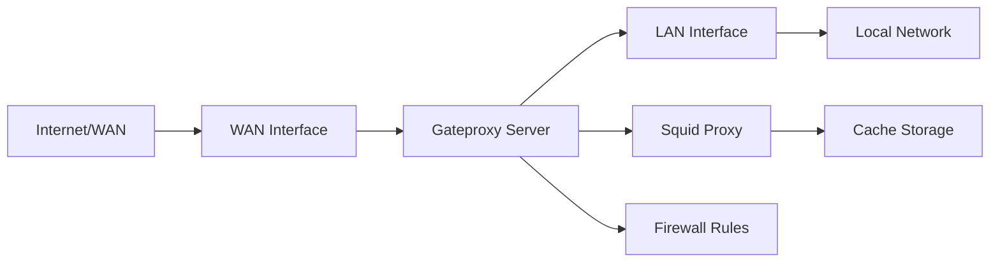

<Note>
  **Status**: Beta - This project is under active development and may contain bugs. Not recommended for high-volume production environments.
</Note>

## Overview

Gateproxy is a simple proxy/firewall server for managing Pyme's LAN networks. The installation and configuration script is fully automated and customizable according to the needs of the administrator or organization, with minimal interaction during the process. It can be implemented in physical servers or VMs, for greater flexibility and portability.

## System Requirements

<CardGroup cols={2}>
  <Card title="Operating System" icon="ubuntu">
    Ubuntu 24.04.x LTS
  </Card>
  <Card title="CPU" icon="microchip">
    Intel Core i5/Xeon or AMD Ryzen 5 (≥ 3.0 GHz)
  </Card>
  <Card title="Network" icon="network-wired">
    2 NICs (WAN & LAN)
  </Card>
  <Card title="Memory" icon="memory">
    16-32 GB RAM (4 GB cache_mem)
  </Card>
  <Card title="Storage" icon="hard-drive">
    100 GB SSD (cache_dir rock)
  </Card>
</CardGroup>

## Installation

### Download Project

First, download the project using the gitfolder utility:

```bash
sudo apt install -y python-is-python3
wget -qO gitfolder.py https://raw.githubusercontent.com/maravento/vault/master/scripts/python/gitfolder.py
chmod +x gitfolder.py
python gitfolder.py https://github.com/maravento/vault/gateproxy
```

### Run Installation

Execute the automated installation script:

```bash
wget -q -N https://raw.githubusercontent.com/maravento/vault/master/gateproxy/gateproxy.sh
sudo chmod +x gateproxy.sh
sudo ./gateproxy.sh
```

<Tip>
  The installation script is fully automated and requires minimal user interaction. It will configure both the proxy and firewall components automatically.
</Tip>

## Features

- **Automated Setup**: Fully automated installation and configuration process
- **Customizable Configuration**: Adaptable to specific organizational needs
- **Dual Network Interface**: Supports separate WAN and LAN interfaces
- **Flexible Deployment**: Compatible with both physical servers and virtual machines
- **Squid Proxy**: Built-in caching proxy server for improved performance
- **Firewall Integration**: Integrated firewall rules for network security
- **High Performance**: Optimized for fast cache operations with SSD storage

## Documentation

For detailed setup instructions and configuration options, refer to the official PDF guide:

<Card title="Setup Guide" icon="file-pdf" href="https://raw.githubusercontent.com/maravento/vault/master/gateproxy/howto/gateproxy.pdf">
  Complete installation and configuration manual
</Card>

## Architecture



## Important Considerations

<Warning>
  Gateproxy is a script under development and may contain bugs, which will be fixed as soon as possible. It may also contain some programs for testing purposes. Therefore, its use in high-volume networks or production environments is not recommended.
</Warning>

### Network Configuration

- Ensure you have two network interfaces configured (one for WAN, one for LAN)
- The WAN interface should have internet connectivity
- The LAN interface should be connected to your local network
- Proper IP routing must be configured between interfaces

### Performance Optimization

- **Cache Memory**: The system allocates 4 GB for cache_mem to improve response times
- **SSD Storage**: Uses SSD storage with rock cache_dir for optimal disk I/O
- **CPU Requirements**: Multi-core processor recommended for handling concurrent connections

## Troubleshooting

<AccordionGroup>
  <Accordion title="Installation fails">
    - Verify you're running Ubuntu 24.04.x
    - Ensure you have sudo privileges
    - Check internet connectivity
    - Verify both network interfaces are properly configured
  </Accordion>
  
  <Accordion title="Proxy not working">
    - Verify Squid service is running: `systemctl status squid`
    - Check Squid configuration: `sudo squid -k parse`
    - Review Squid logs: `tail -f /var/log/squid/access.log`
    - Ensure client devices are configured to use the proxy
  </Accordion>
  
  <Accordion title="Performance issues">
    - Monitor cache performance
    - Check available disk space for cache
    - Verify RAM allocation for cache_mem
    - Review network bandwidth utilization
  </Accordion>
</AccordionGroup>

## License

<CardGroup cols={2}>
  <Card title="GPL-3.0" icon="scale-balanced">
    Licensed under GNU General Public License v3.0
  </Card>
  <Card title="CC BY-SA 4.0" icon="creative-commons">
    Documentation under Creative Commons Attribution-ShareAlike 4.0
  </Card>
</CardGroup>

## Disclaimer

<Warning>
  THE SOFTWARE IS PROVIDED "AS IS", WITHOUT WARRANTY OF ANY KIND, EXPRESS OR IMPLIED, INCLUDING BUT NOT LIMITED TO THE WARRANTIES OF MERCHANTABILITY, FITNESS FOR A PARTICULAR PURPOSE AND NONINFRINGEMENT. IN NO EVENT SHALL THE AUTHORS OR COPYRIGHT HOLDERS BE LIABLE FOR ANY CLAIM, DAMAGES OR OTHER LIABILITY, WHETHER IN AN ACTION OF CONTRACT, TORT OR OTHERWISE, ARISING FROM, OUT OF OR IN CONNECTION WITH THE SOFTWARE OR THE USE OR OTHER DEALINGS IN THE SOFTWARE.
</Warning>
